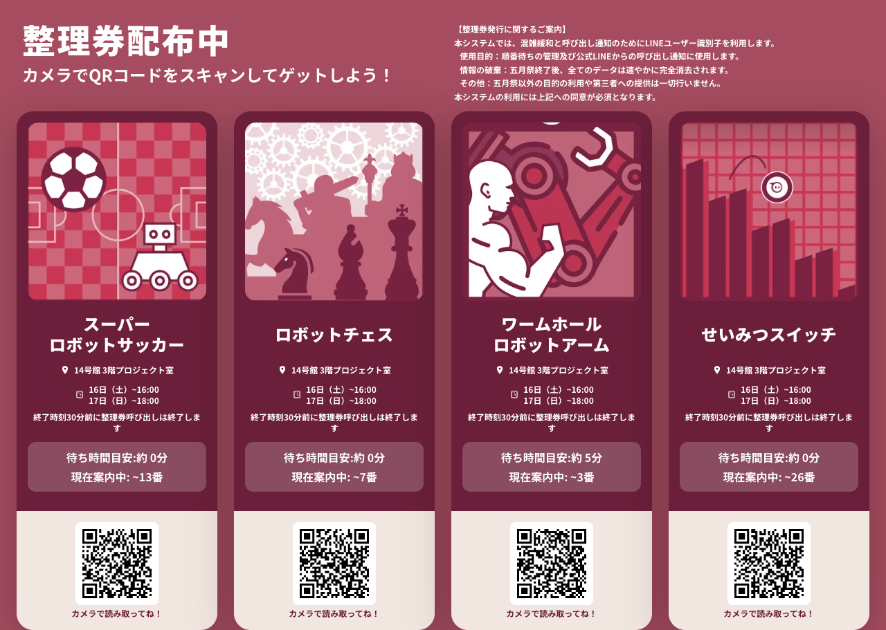
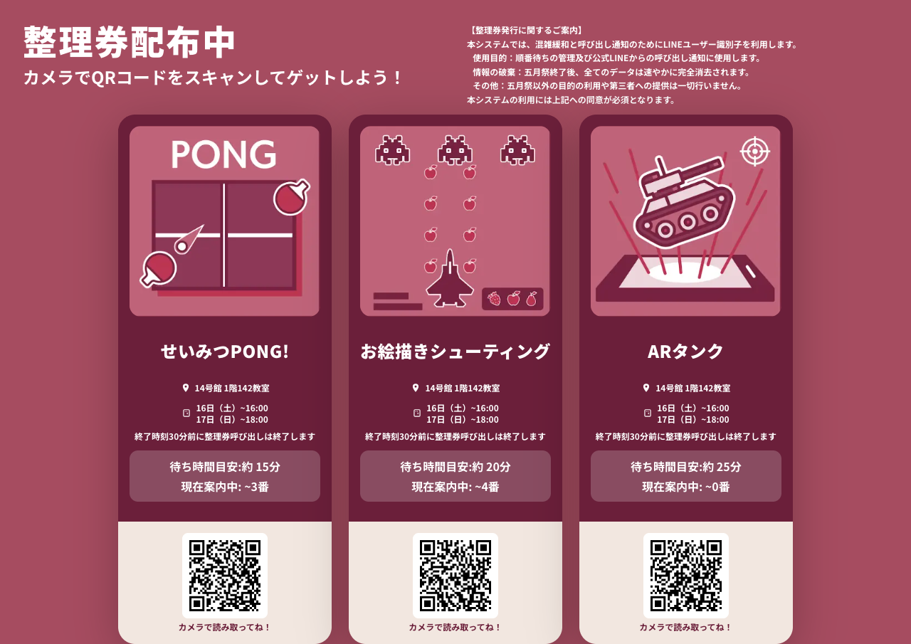
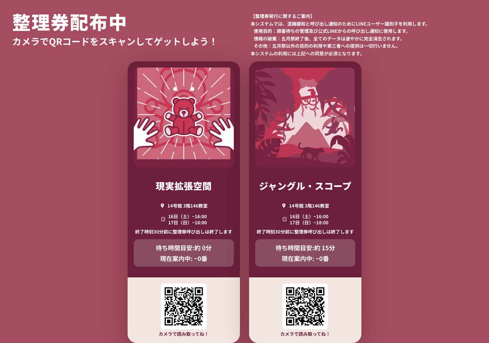
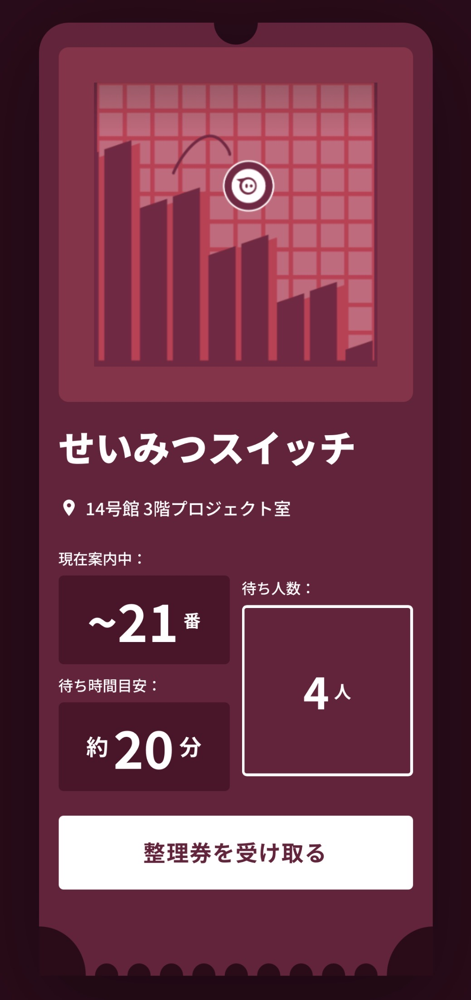
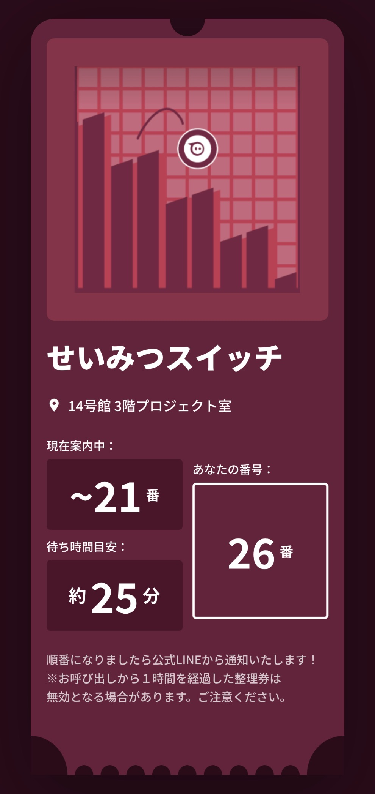
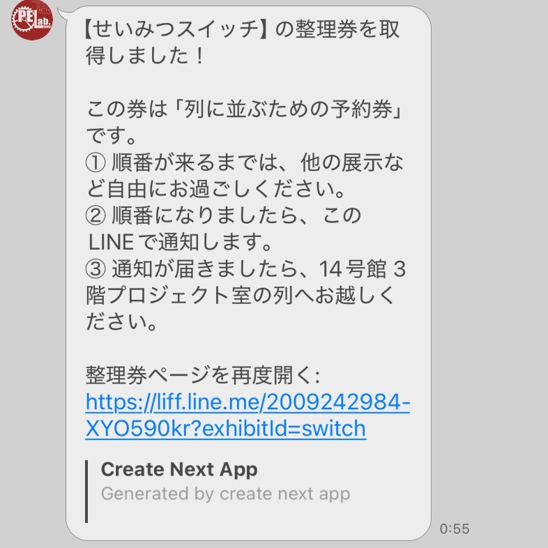
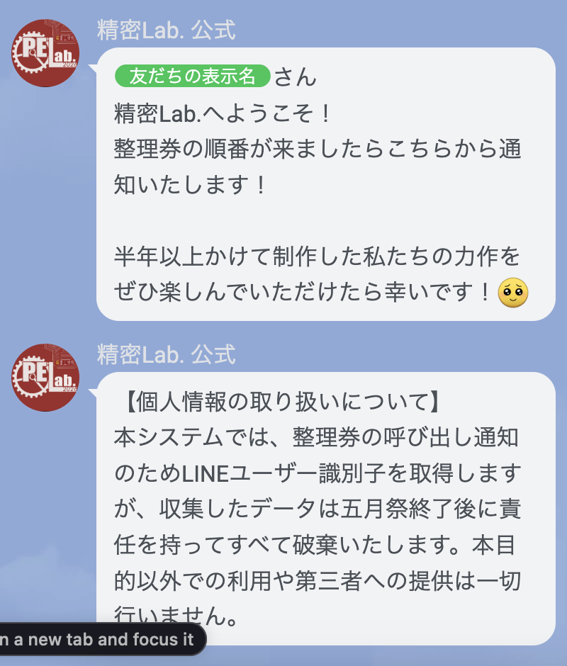
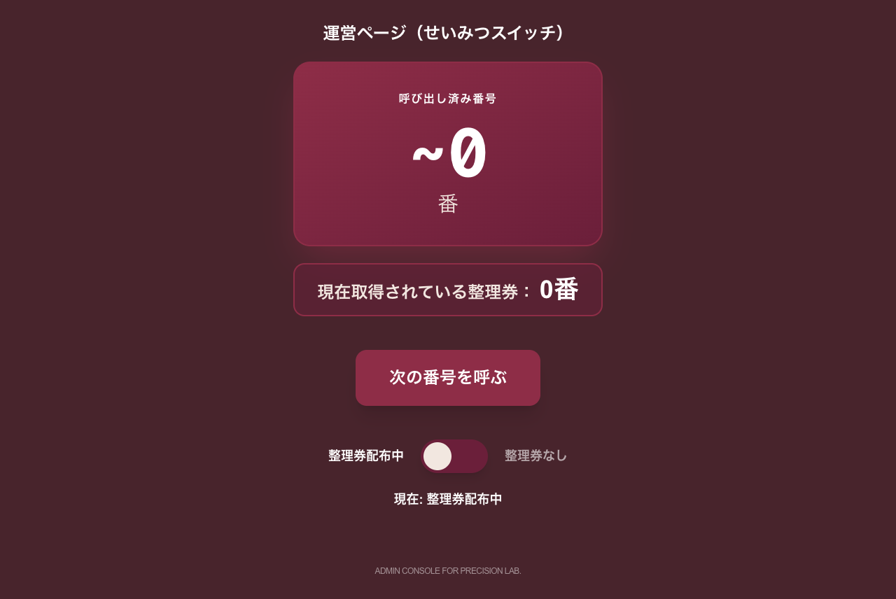
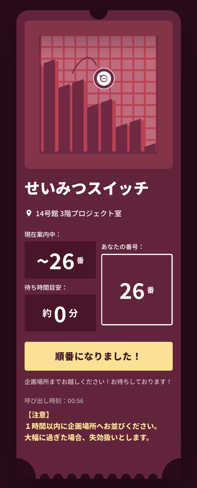
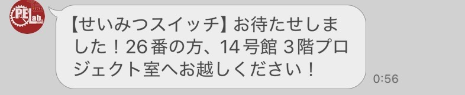

# 精密Lab. 整理券システム

五月祭における企画の混雑緩和を目的として開発した、LINE連携型のリアルタイム整理券システムです。

---

## 概要

来場者がQRコードをスキャンするとLINEアプリ上で整理券を取得でき、順番が来たら自動でLINE通知が届きます。運営スタッフは管理者画面から順番を進めるだけで、呼び出し通知まで自動で行われます。

---

## 機能

- **整理券の発行** — LINEログイン後、ボタン一つで整理券を取得
- **リアルタイム待ち状況** — 現在の案内番号・待ち人数・待ち時間目安をリアルタイムで表示
- **LINE通知** — 順番が来たら来場者のLINEに自動でメッセージを送信（取得確認・呼び出しの2段階）
- **案内画面** — 各企画のQRコードと待ち時間を一覧表示（スタッフが掲示用に使用）
- **運営ダッシュボード** — 全8企画を1画面で管理。管理者認証付き
- **個別管理者画面** — 企画ごとの詳細な管理（配布開始・停止も含む）

---

## 運営時の使い方

### 当日運用前チェックリスト

当日システムを起動する前に必ず確認する。

- [ ] Firebase Console → Firestore → `tickets` コレクション内に全8企画のドキュメントが存在するか確認（存在しない場合は手動作成）
  - フィールド：`nowServing: 0`、`currentNumber: 0`、`distributionEnabled: true`
- [ ] LINE Channel Access Token が Vercel の環境変数に設定されているか確認
- [ ] 管理者画面へのログインができるか事前テスト
- [ ] 各案内画面のQRコードをLINEアプリカメラで読み取れるかテスト

> **注意：** Firestoreのドキュメントが存在しない状態だと、来場者画面・管理画面ともに正常に動作しない。

---

### 案内画面（モニター掲示用）

企画場所のモニターで以下のURLを開く。来場者がQRをスキャンして整理券を取得できる。QRコードは必ずLINEアプリのカメラで読み取ること。

| 企画場所       | URL                                              |
| -------------- | ------------------------------------------------ |
| プロジェクト室 | https://seimitsu-ticket.vercel.app/guide/project |
| 142号室        | https://seimitsu-ticket.vercel.app/guide/142     |
| 146号室        | https://seimitsu-ticket.vercel.app/guide/146     |

---

### 運営ダッシュボード（全8企画を1画面で管理）

https://seimitsu-ticket.vercel.app/admin

メールアドレスとパスワードでログインすると、全8企画のリアルタイム状況と「次の番号を呼ぶ」ボタンが1画面に表示される。複数企画を兼任するスタッフや、全体を俯瞰したい場合に使う。

| 表示項目     | 内容                               |
| ------------ | ---------------------------------- |
| 呼び出し済み | 現在呼び出した最大番号             |
| 発行済み     | 発行された整理券の最大番号         |
| 待ち人数     | 発行済み − 呼び出し済みの差        |
| 配布状態     | 「配布中」または「配布終了」バッジ |

LINE通知が失敗した場合はカード上にエラーメッセージが表示される（3秒後に自動消去）。口頭での案内に切り替えること。

---

### 個別管理者画面（企画ごとの詳細操作）

URLに `?exhibitId=xxx` をつけてアクセスする。配布の開始・停止トグルが必要な場合はこちらを使う。

| 企画名 | URL |
|---|---|
| スーパーロボットサッカー | https://seimitsu-ticket.vercel.app/admin?exhibitId=soccer |
| ワームホールロボットアーム | https://seimitsu-ticket.vercel.app/admin?exhibitId=arm |
| せいみつスイッチ | https://seimitsu-ticket.vercel.app/admin?exhibitId=switch |
| せいみつPONG! | https://seimitsu-ticket.vercel.app/admin?exhibitId=pong |
| お絵描きシューティング | https://seimitsu-ticket.vercel.app/admin?exhibitId=shooting |
| ARタンク | https://seimitsu-ticket.vercel.app/admin?exhibitId=tank |
| 現実拡張空間 | https://seimitsu-ticket.vercel.app/admin?exhibitId=room |
| ジャングル・スコープ | https://seimitsu-ticket.vercel.app/admin?exhibitId=truck |

メールアドレスとパスワードでログインする。アカウントは Firebase Console → Authentication → Users で管理。

「次の番号を呼ぶ」ボタンを押すだけで、次の来場者にLINE通知が送られる。LINE通知が失敗した場合は画面上にエラーメッセージが表示されるため、口頭での案内に切り替えること。

「整理券配布中 / 整理券なし」トグルで配布の開始・停止も可能。**OFFに切り替える際は確認ダイアログが表示される。承認すると待機中の全員に一斉通知が飛び、取り消し不可のため慎重に操作すること。**

---

## システムの仕組み

### 1. モニター表示（guide/project・guide/142・guide/146）

企画場所に設置したモニターで各 guide サブページを開く。各企画カードに LIFF URL（`?exhibitId=xxx`）が埋め込まれたQRコードが表示される。Firestoreの `tickets/{exhibitId}` を `onSnapshot` でリアルタイム監視しており、待ち人数・待ち時間目安・案内中番号が自動更新される。





`distributionEnabled: false` の場合はQRコードが非表示になり「案内中」メッセージに切り替わる。

---

### 2. 来場者がQRをスキャン → 整理券取得

QRをスキャンするとLINEアプリ内でLIFFページが開き、LINEログインが走る。同時にFirebase匿名認証（`signInAnonymously`）も実行され、Firestoreへのアクセス権を取得する。



「整理券を受け取る」をタップすると、Firestoreトランザクションで以下が原子的に実行される：

- `tickets/{exhibitId}` の `nowServing` をインクリメント（重複防止）
- `users/{userId}/myTickets/{exhibitId}` に整理券番号・発行時刻を記録
- `active_tickets/{exhibitId}_{ticketNumber}` に userId を登録（呼び出し時の通知先として使用）

発行完了後、サーバーアクション経由でLINEに取得確認メッセージを送信。送信に失敗した場合は整理券ページ上に警告メッセージが表示される。





LINE Official Accountをフォローした時点でウェルカムメッセージも自動送信される。



---

### 3. 管理画面で呼び出し

管理画面（`/admin?exhibitId=xxx`）はFirebaseのメール/パスワード認証で保護。



「次の番号を呼ぶ」ボタンを押すと以下が実行される：

1. `tickets/{exhibitId}` の `currentNumber` を +1、`currentNumber_called_at`（呼び出し時刻）を記録
2. `active_tickets/{exhibitId}_{newCurrentNumber}` から `userId` を取得
3. サーバーアクション経由で該当ユーザーにLINE呼び出し通知を送信

`currentNumber > nowServing` の場合はエラーになり通知は送られない。

「整理券配布中 / 整理券なし」トグルで `distributionEnabled` を切り替えることもできる。OFFへの切り替えは確認ダイアログが表示され、承認後に実行される。

- **OFF にした場合**：`currentNumber` を `nowServing` と同値に更新し、未呼び出し全員に一括LINE通知を送信。guide画面のQRコードが非表示になり新規発行が止まる。
- **ON に戻した場合**：`distributionEnabled: true` を書き込むだけ。QRコードが再表示される。

---

### 4. 来場者側の画面が自動更新 → LINE通知

来場者のページは `onSnapshot` で `tickets/{exhibitId}` を監視しているため、`currentNumber` が更新されると即座に「順番になりました！」に切り替わる。同時にLINEにも呼び出し通知が届く。呼び出しから1時間以内に来場しなければ失効扱い。





---

## 引き継ぎ手順

次年度や別の担当者にシステムを引き継ぐ際の手順。

### 1. Firebase のアクセス権を付与する

Firebase Console → 左上の歯車アイコン「プロジェクトの設定」→「ユーザーと権限」タブ → 「メンバーを追加」

引き継ぎ先の Google アカウントのメールアドレスを入力し、役割を選択して追加する。

| 役割     | 権限                               |
| -------- | ---------------------------------- |
| オーナー | 全権限（プロジェクト削除も可）     |
| 編集者   | 設定変更・データ操作が可能（推奨） |
| 閲覧者   | 読み取りのみ                       |

### 2. Vercel のアクセス権を付与する

**① 引き継ぎ先が Vercel アカウントを作成する**

https://vercel.com にアクセスし、GitHub アカウントでサインアップする。

**② プロジェクトを転送する**

現在のオーナーが以下の手順でプロジェクトを転送する：

Vercel Dashboard → `seimitsu-ticket` → Settings → General → 「Transfer」ボタン

転送先のVercelアカウントのユーザー名またはメールアドレスを入力して転送する。環境変数（`LINE_CHANNEL_ACCESS_TOKEN` / `ADMIN_PASSWORD` / `NEXT_PUBLIC_FIREBASE_*`）もそのまま引き継がれる。

### 3. 管理者権限を付与する（Firestore）

Firebase Console → Firestore → `admins` コレクション → 「ドキュメントを追加」

引き継ぎ先のスタッフの UID をドキュメント ID として追加する。UID は Firebase Console → Authentication → Users から確認できる（管理画面 `/admin` に一度アクセスしてもらえば自動でユーザー登録される）。

```
admins/
  {引き継ぎ先のUID}
    name: "担当者名"
```

### 4. GitHub リポジトリのアクセス権を付与する

GitHub → リポジトリページ → Settings → Collaborators → 「Add people」

引き継ぎ先の GitHub アカウントを追加する。

### 5. LINE のアクセス権を移譲する

**① LINE Official Account Manager（公式LINEの管理）**

manager.line.biz → 設定 → 権限管理 → 権限の種類を「管理者」に選択 → 「URLを発行」

発行されたURLを引き継ぎ先のLINEに送り、承認してもらう。承認確認後、自分のアカウントを権限リストから削除する。

> URLは24時間で失効するため、すぐに開いてもらうこと。

**② LINE Developers Console（LIFF・Messaging APIの設定）**

developers.line.biz → プロバイダー → チャンネル → 「Members」タブ → 引き継ぎ先のLINEアカウントを追加 → 自分を削除

---

### 6. Firestoreの初期データをリセットする

新年度の開始前に、前年のデータをリセットする。

> **注意：** Firebase Console へのアクセスには、事前に手順 1. でメンバー追加してもらう必要がある。

[Firebase Console](https://console.firebase.google.com) → `seimitsu-ticket` プロジェクト → Firestore Database

1. `users` コレクション → すべてのドキュメントを削除
2. `active_tickets` コレクション → すべてのドキュメントを削除
3. `tickets` コレクション → 各ドキュメントの `currentNumber` と `nowServing` を `0`、`distributionEnabled` を `true` にリセット

**ドキュメントID**（exhibitId）と対応する企画：

| exhibitId | 企画名                     |
| --------- | -------------------------- |
| soccer    | スーパーロボットサッカー   |
| arm       | ワームホールロボットアーム |
| switch    | せいみつスイッチ           |
| pong      | せいみつPONG!              |
| shooting  | お絵描きシューティング     |
| tank      | ARタンク                   |
| room      | 現実拡張空間               |
| truck     | ジャングル・スコープ       |

---

## 開発環境のセットアップ

コードを変更・拡張する場合のローカル環境構築手順。

### 1. リポジトリをクローン

```bash
git clone https://github.com/kojumaru/seimitsu-ticket.git
cd seimitsu-ticket
npm install
```

### 2. 環境変数を設定

`.env.example` をコピーして `.env.local` を作成し、各値を入力する。

```bash
cp .env.example .env.local
```

必要な環境変数：

- `NEXT_PUBLIC_FIREBASE_*` — Firebase設定（クライアント側）
- `LINE_CHANNEL_ACCESS_TOKEN` — LINE Official Accountのトークン

### 3. 動作確認

ローカルで素早く確認する場合（Vercelのデプロイを待たずに手元で確認できる）：

```bash
npm run dev
```

`http://localhost:3000` でアプリが起動する。

変更をそのまま本番に反映したい場合は push するだけでよい。Vercel が自動でビルド・デプロイする。

本番URL：https://seimitsu-ticket.vercel.app

---

## Firebase設定

### Firestoreコレクション構成

```
tickets/
├── {exhibitId}/
│   ├── currentNumber: Number (呼び出し済みの番号)
│   ├── nowServing: Number (発行済みの最大番号)
│   └── distributionEnabled: Boolean

users/
├── {userId}/
│   └── myTickets/
│       └── {exhibitId}/
│           ├── ticketNumber: Number
│           └── timestamp: Timestamp

active_tickets/
├── {exhibitId}_{ticketNumber}/
│   └── userId: String

admins/
├── {uid}/
│   └── name: String
```

---

## デプロイ

```bash
git push origin main
```

Vercel の自動デプロイが有効になっているため、プッシュと同時にデプロイが開始される。

---

## 技術スタック

| 技術                    | 用途                               |
| ----------------------- | ---------------------------------- |
| Next.js 16 (App Router) | フレームワーク・サーバーアクション |
| React 19                | UIコンポーネント                   |
| TypeScript              | 型安全な開発                       |
| Tailwind CSS            | スタイリング                       |
| Firebase (Firestore)    | リアルタイムデータ管理             |
| LINE LIFF               | LINEログイン・ユーザー識別         |
| LINE Messaging API      | プッシュ通知                       |
| Framer Motion           | アニメーション                     |
| Vercel                  | デプロイ・ホスティング             |

---

## ディレクトリ構成

```
app/
├── page.tsx                  # 来場者向け：整理券取得・待ち状況画面
├── guide/
│   ├── page.tsx              # 案内用：部屋別ガイド一覧（project / 142 / 146 へのリンク）
│   ├── project/page.tsx      # 案内用：プロジェクト室のQRコード・待ち時間一覧
│   ├── 142/page.tsx          # 案内用：142教室のQRコード・待ち時間一覧
│   └── 146/page.tsx          # 案内用：146教室のQRコード・待ち時間一覧
├── admin/page.tsx            # 運営ダッシュボード（?exhibitId なし）＋ 個別管理画面（?exhibitId=xxx）
├── actions/
│   └── notify.ts             # サーバーアクション（LINE通知）
├── api/
│   └── tickets/route.ts      # チケット情報取得API
├── lib/
│   ├── firebase.ts           # Firebase接続設定
│   ├── proxy.ts              # LINE API呼び出し処理
│   └── constants.ts          # デザイントークン・設定値
└── components/
    └── icons.tsx             # 共通アイコンコンポーネント
```

---

## 参考資料

- [Next.js公式ドキュメント](https://nextjs.org)
- [Firebase Firestore](https://firebase.google.com/docs/firestore)
- [LINE LIFF](https://developers.line.biz/ja/docs/liff/)
- [LINE Messaging API](https://developers.line.biz/ja/docs/messaging-api/)
